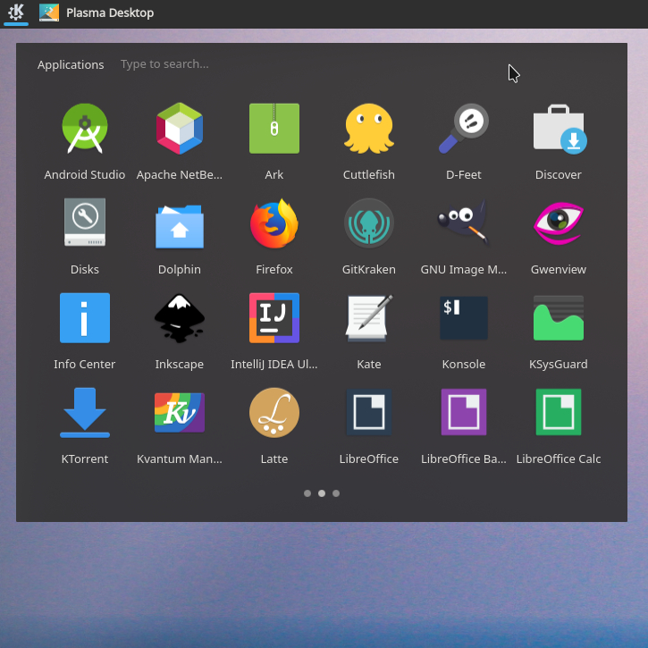

# Minimal Menu

    

## A minimal application menu for KDE Plasma
This is a fork of <a href=https://github.com/KDE/plasma-simplemenu>Simple menu</a>.

### Install

cmake -DCMAKE_INSTALL_PREFIX:PATH=~/.local . && make all install

### Restart plasma
kquitapp5 plasmashell && sleep 2 && kstart5 plasmashell

## Known issues

### Application hiding
After selecting "Hide application" from an application's context menu, it will
remain visible. A workaround is to select "Edit application..." from the context
menu for any application after selecting "Hide application" for all the
applications you want to hide. Then in the dialog that opens just click "Ok",
and that should refresh the applications, and hide all applications that were
marked for hiding.
